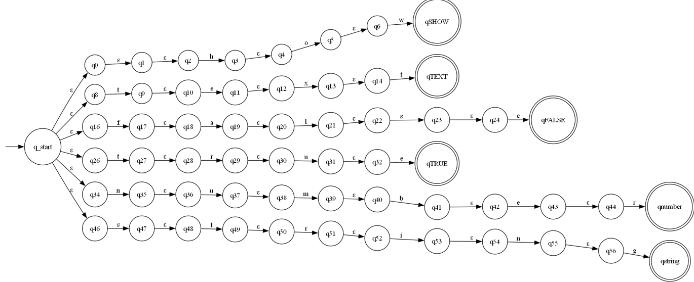

# Analisador Léxico: Projeto de compialdores- README

## 📌 Visão Geral
Este projeto implementa um **analisador léxico** para processamento de linguagens de programação. O analisador lêxico é a primeira etapa do processo de compilação de uma linguagem e transforma código-fonte em uma sequência de tokens, que são a base para análises sintáticas posteriores.

## 🔍 Aprofundamento Técnico
 Nossa linguagem é simplificada, mas segue a estrutura de um analisador léxico real. O processo de análise léxica segue estas etapas fundamentais:

1. **Código Fonte**  
   Entrada bruta do programa a ser compilado  
   Exemplo: `show "Result: ", x + 42;`

2. **Expressões Regulares/regex**  
   Cada tipo de token é definido por um padrão:  
   ```python
   tokens = [
       ('SHOW', r'show'),
       ('STRING', r'"[^"]*"'),
       ('NUMBER', r'[0-9]+'),
   ]
   ```

3. **Construção de NFAs**  
   Cada regex é convertido em um Autômato Finito Não-Determinístico:  

4. **Unificação de NFAs**  
   Todos os NFAs são combinados em um autômato único:  

5. **Conversão para DFA**  
   O NFA unificado é transformado em Autômato Finito Determinístico para eficiência.

6. **Análise Léxica**  
   O DFA processa o código fonte, identificando tokens:  
   ```
   SHOW STRING VAR PLUS NUM SEMICOLON
   ```


## ✨ Funcionalidades
- [x] Reconhecimento de tokens (palavras-chave, identificadores, literais)
- [x] Geração de NFAs (Autômatos Finitos Não-Determinísticos) para padrões lexicais
- [x] Visualização gráfica dos autômatos (requer a biblioteca Graphviz)

## 🛠️ Tecnologias
- **Python 3.8+**
- **Graphviz** (para visualização)
- **Regex** (para padrões lexicais)

### Visualização de Autômatos
```python
from nfa import build_combined_nfa, draw_nfa

# Define seus padrões léxicos
tokens = [
    ('IF', r'if'),
    ('ID', r'[a-zA-Z_][a-zA-Z0-9_]*'),
    ('NUMBER', r'[0-9]+')
]

nfa = build_combined_nfa(tokens)
draw_nfa(nfa, "meu_nfa")  # Gera meu_nfa.png
```

## 📂 Estrutura do Projeto
```
analisador-lexico/
├── img_nfa              #Imagem gerada do nfa
│   ├── nfa.png
│   ├── nfa.doc         
├── lex_analiser.py      #Arquivo a ser executado
├── nfa.py               #Arquivo para crianção e unificação de nfas
└── README.md            #Arquivo de apresentação
```

---

## 🧩 Tabela de Tokens

| Tipo       | Regex                         | Exemplos           |    |
| ---------- | ----------------------------- | ------------------ | -- |
| NUM        | `[0-9]+`                      | `932`, `5`, `89`   |    |
| STRING     | `"[^"]*"`                     | `"this is a text"` |    |
| TEXT       | `text`                        | `text`             |    |
| VAR        | `[a-zA-Z_][a-zA-Z0-9_]{0,29}` | `if9`, `_var123`   |    |
| number     | `number`                      | `number variavel`  |    |
| string     | `string`                      | `string variavel`  |    |
| FALSE      | `false`                       | `false`            |    |
| TRUE       | `true`                        | `true`             |    |
| SHOW       | `show`                        | `show`             |    |
| PLUS       | `\+`                          | `+`                |    |
| MINUS      | `-`                           | `-`                |    |
| MPY        | `\*`                          | `*`                |    |
| DIV        | `/`                           | `/`                |    |
| GT         | `>`                           | `>`                |    |
| LT         | `<`                           | `<`                |    |
| EQ         | `=`                           | `=`                |    |
| EXC        | `!`                           | `!`                |    |
| AT         | `@`                           | `@`                |    |
| HASH       | `#`                           | `#`                |    |
| DOLLAR     | `\$`                          | `$`                |    |
| PCT        | `%`                           | `%`                |    |
| AMPERSAND  | `&`                           | `&`                |    |
| QUESTION   | `\?`                          | `?`                |    |
| UNDERSCORE | `_`                           | `_`                |    |
| PIPE       | `\|`                          | \`                 | \` |
| SEMICOLON  | `;`                           | `;`                |    |

---
